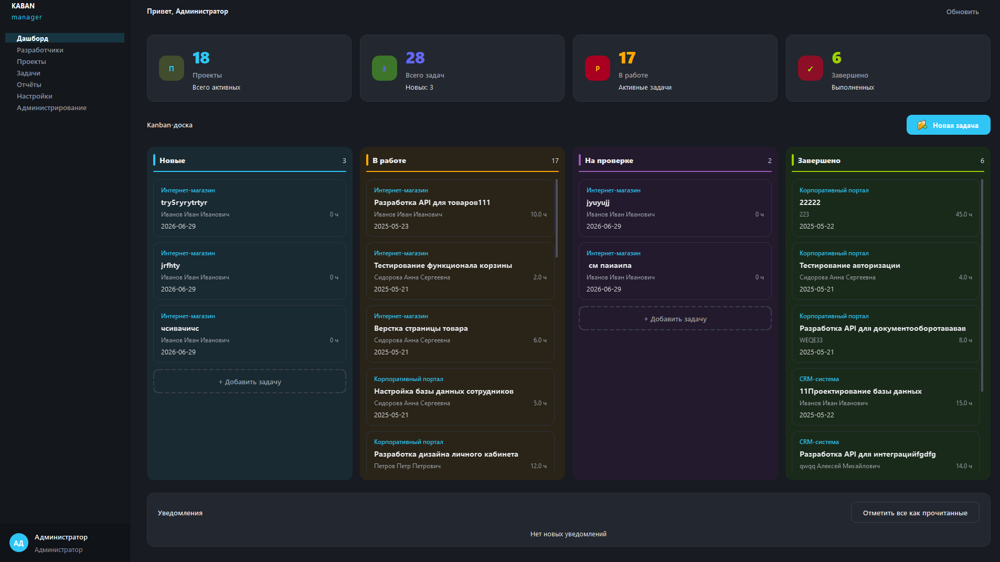
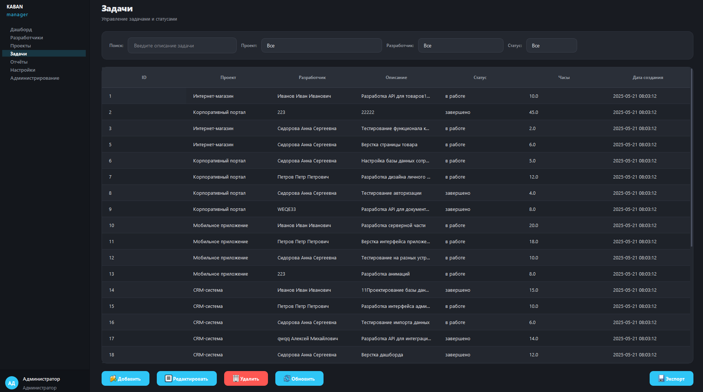
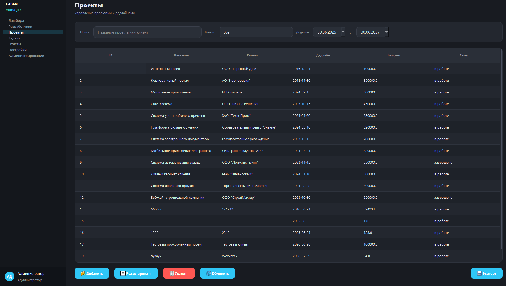
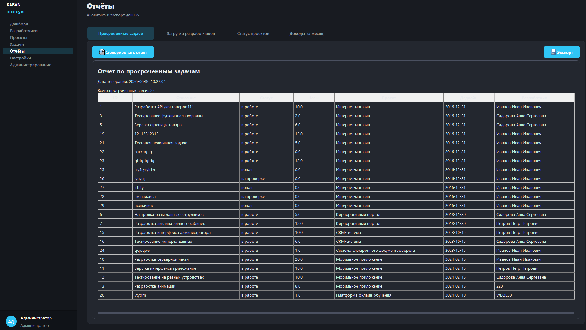
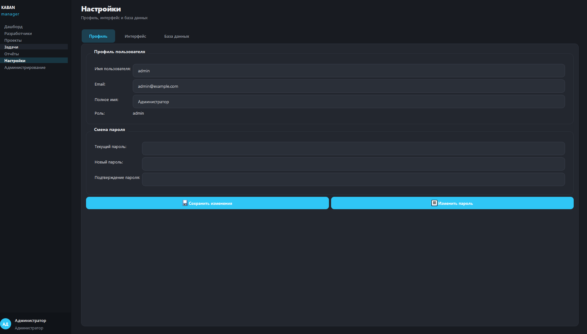

<div align="center">

# KABAN


KABANchik

**A small Kanban/IT-project management database + Python init/tests (SQLite).**

</div>

---

## Quest Log
You found an *IT Projects Kanban* database with:
- `developers`, `projects`, `tasks` tables
- views for quick analytics (`view_task_details`, `view_project_stats`, `view_developer_stats`)
- triggers that protect from duplicates (upsert-like behavior)
- seed data for instant queries

If you’re a recruiter: this repo is mostly about **SQL schema design** + **Python automation/tests**.

---

## Tech Stack
- **Python**: simple DB init + smoke tests
- **SQLite**: single-file database
- **SQL**: schema, indexes, views, triggers, seed data

---

## Map
- `database/kaban.sql` — schema + views + triggers + demo data
- `database/init_db.py` — creates/initializes the SQLite DB from SQL script
- `database/kabanmanagement_it-projects.sqlite` — generated DB (example)
- `docs/BD_diagram.png` — ER diagram
- `src/tests/db.py` — unittest suite that validates tables/views/triggers

---

## Screenshots

> Drop PNG files into `docs/screenshots/` using the names below — they will show up here automatically.

| Dashboard (Kanban) | Tasks |
| :---: | :---: |
|  |  |

| Projects | Reports |
| :---: | :---: |
|  |  |

<details>
<summary>Theme settings (optional)</summary>



</details>

### What to capture

| File | Screen | What to show |
|------|--------|--------------|
| `01-dashboard.png` | Dashboard | Kanban with cards in every column, stats, notifications |
| `02-tasks.png` | Tasks | Populated table, filters |
| `03-projects.png` | Projects | Project list with data |
| `04-reports.png` | Reports | Generated report or analytics tab |
| `05-settings.png` | Settings | Theme / accent color picker |

---

## Features

- **Kanban dashboard** — task board by status, quick cards, add tasks
- **Task management** — CRUD, filtering, link to project and developer
- **Projects & developers** — clients, deadlines, hourly rates
- **Reports & export** — overdue tasks, analytics, CSV / Excel export
- **Notifications** — deadline and overdue project alerts
- **User roles** — admin, manager, developer (different tab sets)
- **Themes** — light / dark mode, customizable accent color
- **Authentication** — login, registration, admin panel

---

## Quick Start

### Requirements

- Python 3.10+
- Windows / Linux / macOS

### Install & run

```bash
git clone https://github.com/top-secret666/KABAN.git
cd KABAN
pip install -r requirements.txt
python main.py
```

On first launch, `database/kaban.db` is created automatically from `database/kaban.sql`.

### Default accounts

| Login | Password | Role |
|-------|----------|------|
| `admin` | `admin` | Administrator |
| `manager` | `password123` | Manager |
| `developer1` | `password123` | Developer |

---
## Database

Schema: `developers`, `projects`, `tasks`, `users`, `notifications` tables + analytics views.

- `database/kaban.sql` — full schema, triggers, demo data
- `database/init_db.py` — manual DB initialization
- `docs/er-диаграмма-kaban_manager.mermaid` — ER diagram

Sample queries:

```sql
SELECT * FROM view_task_details LIMIT 10;
SELECT * FROM view_project_stats ORDER BY completion_percentage DESC;
```
---

## Notes
- The `src/main/**` package structure is prepared for a future app layer (controllers/services/views), but the core of the project is the **DB layer**.
- If you want to open the DB visually, any SQLite client works (DB Browser for SQLite / DBeaver).

---

## License

This project is licensed under the [MIT License](LICENSE).

---

<div align="center">

good luck ;)

</div>
